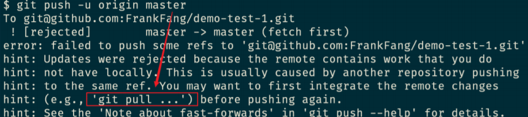

# 燕凯的Markdown博客
## git本地仓库
1. git init 创建本地仓库
2. git add 将文本标记为提交模式
3. git commit -v 提交commit并进行修改内容记录
4. git reset --hard xxxxx 版本横跳（御剑飞行）
5. git log 查看历史提交（女朋友视角）
6. git reflog 查看所有提交 （男主视角）
7. git branch x 创建分支
8. git checkout x 跳转到分支
9. git merge 合并分支
10. git branch -d x 删除分支
## git远程仓库
上传程序到远程仓库步骤
  * 上传秘钥
  * git
```bash
git remote add origin git@github.com:KailoveQ/markdown.git
git branch -M main
git push -u origin main
```
  * 如果提示push，那就push一下，如下图：

* 还不行的话就[点我](https://www.jirengu.com)